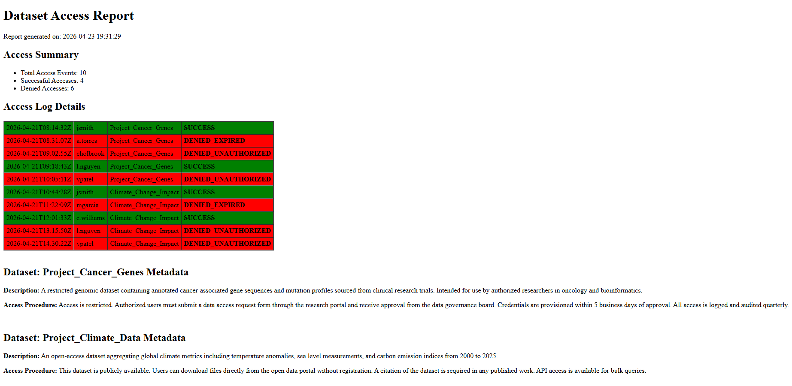
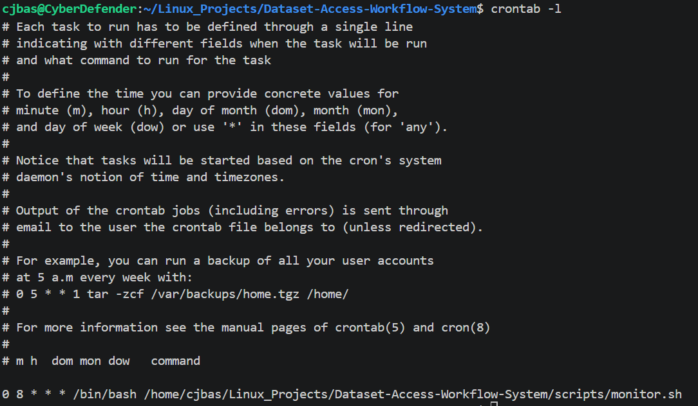

# Dataset-Access-Workflow-System
A command-line workflow automation tool built on Ubuntu Linux that simulates 
the operational management of scientific dataset-access systems.  

- Reads YAML configuration files defining dataset access rules and user account credentials.
- Parses XML dataset descriptor files to extract structured metadata for reporting.
- Monitors access logs via scheduled Bash automation(Cron) and flags expired/revoked credentials.
- Auto-generates an HTML status report summarizing workflow activity and dataset access procedures.

## Technologies Used
- Python
- Bash
- Ubuntu Linux
- YAML
- XML
- HTML
- Cron

## Project Structure
```
dataset-access-workflow/
├── config/
│   ├── datasets.yaml
│   └── user_accounts.yaml
├── data/
│   └── dataset_metadata.xml
├── logs/
│   ├── access_log.txt
│   ├── monitor_run.log
│   └── expiration_status.log
├── scripts/
│   ├── monitor.sh
│   ├── check_expirations.py
│   ├── parse_log.py
│   └── generate_report.py
└── reports/
    ├── access_summary.csv
    └── dataset_access_report.html
```

## Scripts Overview
| Script | Purpose |
|---|---|
| `monitor.sh` | Main Bash orchestrator — runs all scripts in sequence and logs output |
| `check_expirations.py` | Reads user_accounts.yaml, flags expired/revoked credentials |
| `parse_log.py` | Parses access_log.txt into structured CSV |
| `generate_report.py` | Reads CSV + XML metadata, renders HTML status report |

## How to Run

### Prerequisites
- Ubuntu Linux (or WSL2)
- Python 3.x
- PyYAML: ```pip install pyyaml```  
### Run the Workflow
```chmod +x scripts/monitor.sh```  
```./scripts/monitor.sh```

## Generated Report
Found under ```reports/dataset_access_report.html```  
Here's the file displayed in a web browser:  



## Cron Scheduler
In an actual system this would likely be run everyday so I generated a Cron job to run at the start of a work day:  



## Skills Demonstrated
- YAML and XML configuration file authoring and parsing
- Bash shell scripting and Linux task automation (Ubuntu)
- Python scripting for log parsing, data processing, and report generation
- Cron job scheduling for recurring workflow automation
- HTML report generation from structured data sources